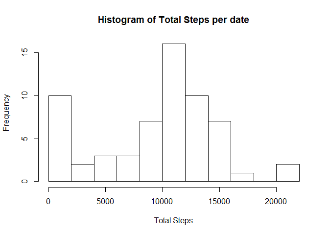
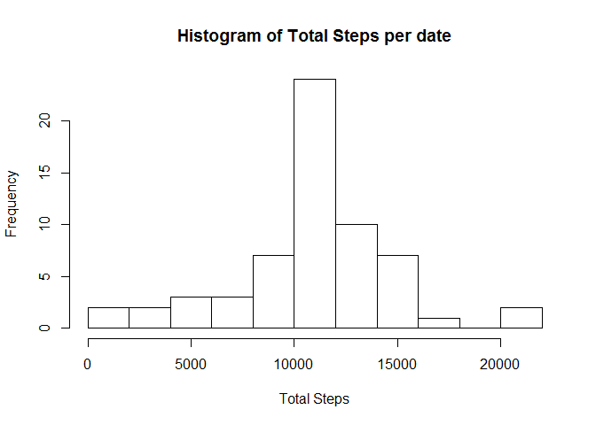
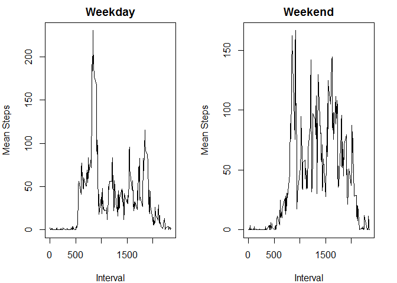

## Personal movement

This study makes use of data from a personal activity monitoring device. This device collects data at 5 minute intervals through out the day. The data consists of two months of data from an anonymous individual collected during the months of October and November, 2012 and include the number of steps taken in 5 minute intervals each day.

### What is mean total number of steps taken per day?

In order to calculate the mean of total numbers of steps taken per day we create the data frame "activity_date" with the dplyr package from the activity data frame grouping by date and summarising all the steps.


```r
library(dplyr)
activity = read.csv(unzip("activity.zip"))
activity_date = activity %>% group_by(date) %>% summarise(Tsteps = sum(steps,na.rm = T))
n_breakss = 15
```

Now we can see the histogram with 15 breaks showing us the total steps per day, which is constructed with the next code.


```r
hist(activity_date$Tsteps,breaks = n_breakss, xlab = "Total Steps",main = "Histogram of Total Steps per date")
```

<!-- -->

```r
mean_steps = mean(activity_date$Tsteps)
median_steps = median(activity_date$Tsteps)
```


From the same data frame we get the mean  and the median daily activity steps which  are 10395 and 9354.2295082 respectively.


## What is the average daily activity pattern?

To answer this we need to create the data frame activity_interval from the activity data frame grouping by interval and summarising all the steps. Once having the data frame we proced ploting the total steps per day with the intervals on a time series graph type.


```r
activity_interval = activity %>% group_by(interval) %>% summarise(Tsteps = mean(steps,na.rm = T))
interval_max_steps = activity_interval$interval[which.max(activity_interval$Tsteps)]
plot(activity_interval$interval,activity_interval$Tsteps,type="l",xlab = "Interval",ylab = "Mean Steps")
```

<!-- -->

Where we can see the maximun value of steps by interval happends in the 835 interval having an average of 206.1698113 steps through  all days.

### Imputing missing values

The data has some days where the values were not given so we must do something with it, but before lets explore how many values and days have this issue.


```r
all_amount_na = length(which(is.na(activity$steps)))
table(activity$date[which(is.na(activity$steps))])[table(activity$date[which(is.na(activity$steps))])>0]
```

```
## 
## 2012-10-01 2012-10-08 2012-11-01 2012-11-04 2012-11-09 2012-11-10 
##        288        288        288        288        288        288 
## 2012-11-14 2012-11-30 
##        288        288
```

Here we can see there are 2304 NA values acrros 8 days having all values as NA.

What we are going to do with this values is imputing in each one of then 
the value who represents the average among the corresponding interval using "activity_interval" data frame as a repository of values to imput. 

The new data framre is called activity2 and was created with the next code:


```r
activity2 = activity

for(i in which(is.na(activity$steps))){
  
  the_interval = activity$interval[i]
  n_val = activity_interval$Tsteps[which(activity_interval$interval==the_interval)]
  activity2$steps[i] = n_val
}
```

With these new data frame we create the grouped data frame activity2_date, created from the dataset activity2 grouping by date and summarising all the steps, and construct the histogram with 15 showing us the total steps per date and calculate the mean and median of the total steps per date


```r
activity2_date = activity2 %>% group_by(date) %>% summarise(Tsteps = sum(steps,na.rm = T))

hist(activity2_date$Tsteps,breaks = n_breakss, xlab = "Total Steps",main = "Histogram of Total Steps per date")
```

<!-- -->

```r
mean2_steps = mean(activity2_date$Tsteps)
median2_steps = median(activity2_date$Tsteps)
```

Now lets see the differece between the mean an median of the data set with NA values and the data set without NA values.


```
##                mean   median
## With NA     9354.23 10395.00
## Without NA 10766.19 10766.19
```

We can observe the difference of these values, and this is because both metrics where calculated having 8 more values not necessarily equal to the ones before so it may and in fact they change.

## Are there differences in activity patterns between weekdays and weekends?

When we ask about the difference in patters between weekdays and weekends we can aproach the answer by creating a new field in the data frame containing these property as a factor variable, this procedure is like follows:


```r
piv_var = weekdays(as.Date(activity2$date))
table(piv_var)
```

```
## piv_var
##   domingo    jueves     lunes    martes miércoles    sábado   viernes 
##      2304      2592      2592      2592      2592      2304      2592
```

```r
# Wee see that we have "lunes","martes","miércoles","jueves","viernes" as weekdays
# and "sábado","domingo" as  weekend 
piv_var[which(is.element(piv_var,c("lunes","martes","miércoles","jueves","viernes")))] = "weekday"
piv_var[which(is.element(piv_var,c("sábado","domingo")))] = "weekend"

activity2$weekday =  piv_var
```

Now with these new variable we proced making a new data frame from activity2 grouping by the new field weekday and interval and summarising the steps. Once with the new data frame "activity2_interval2" we proced ploting the total steps per date with the intervals on a graph like a time series separated by weekday and weekend.


```r
activity2_interval2 = activity2 %>% group_by(weekday,interval) %>% summarise(Tsteps = mean(steps,na.rm = T))

sub_weekday = which(activity2_interval2$weekday =="weekday")
sub_weekend = which(activity2_interval2$weekday =="weekend")
par(mfrow = c(1,2),mar = c(4,4,2,2))
plot(activity2_interval2$interval[sub_weekday],activity2_interval2$Tsteps[sub_weekday],type="l",xlab = "Interval",ylab = "Mean Steps",main="Weekday")
plot(activity2_interval2$interval[sub_weekend],activity2_interval2$Tsteps[sub_weekend],type="l",xlab = "Interval",ylab = "Mean Steps",main="Weekend")
```

<!-- -->

In the previous plot we can see the difference of patterns between weekday and weekend.
